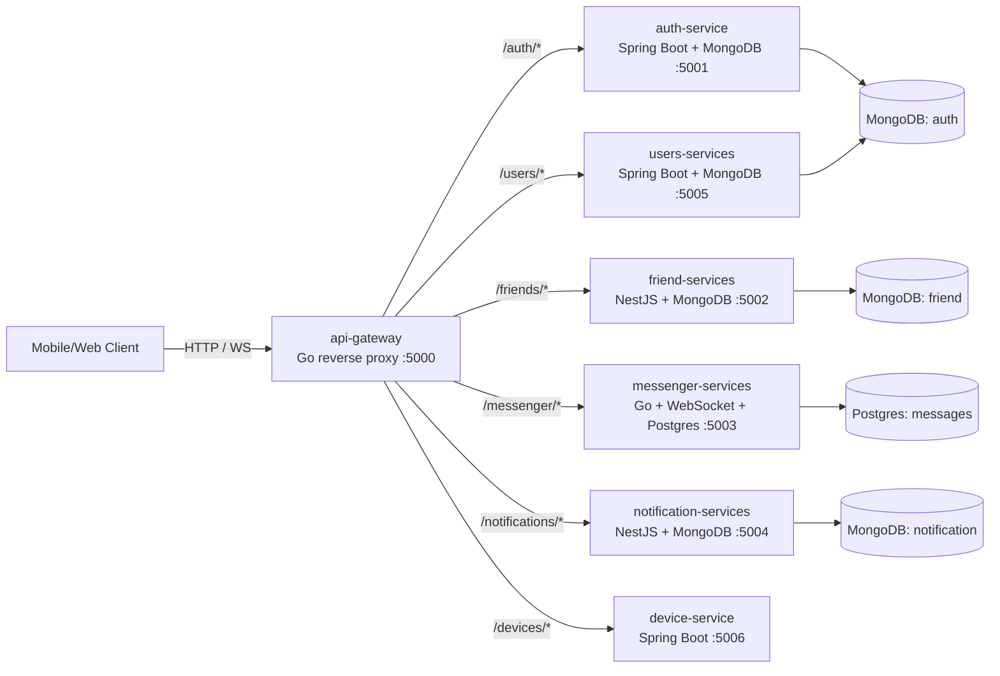
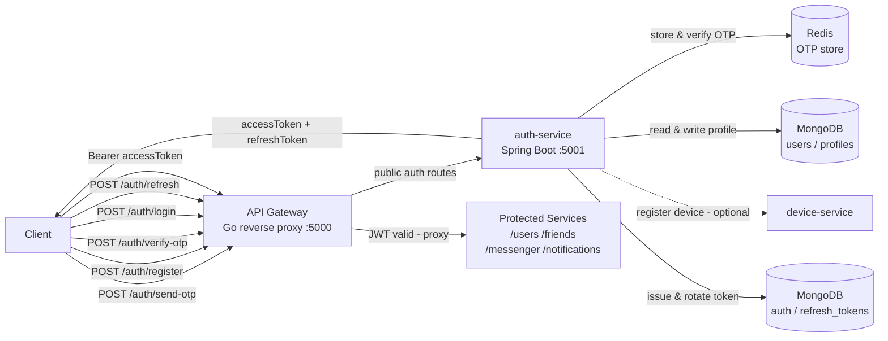

# Backend Architecture (Zalo-like Chat App)

This repository contains a microservices-based backend (Zalo-like chat app). Services are coordinated through an `api-gateway`.

## System overview

Notes:
- Gateway routing is prefix-based (`/auth`, `/friends`, `/messenger`, `/notifications`, `/users`, `/devices`).
- `/messenger` supports WebSocket upgrades.

## Auth flow (Register / Login -> JWT -> Authorized calls)

## Service matrix

| Service | Tech | Port | Responsibility |
|---|---|---:|---|
| `api-gateway` | Go (reverse proxy) | 5000 | Single entry point, routes requests by path prefix |
| `auth-services` | Java 17, Spring Boot, MongoDB, Spring Security, JWT | 5001 | User auth, OTP flow, JWT issuance |
| `friend-services` | NestJS, Mongoose (MongoDB) | 5002 | Friend graph / relationships |
| `messenger-services` | Go, Gorilla WebSocket, Postgres | 5003 | Real-time chat (WS) + persistence |
| `notification-services` | NestJS, Mongoose (MongoDB) | 5004 | Notifications |
| `users-services` | Java 17, Spring Boot, MongoDB | 5005 | User profile read/update APIs |
| `device-service` | Java 17, Spring Boot | 5006 | Device registration metadata |

## Key configuration (high level)

- **Mongo services**: ensure the MongoDB URI includes a database name (e.g. `/auth`, `/friend`, `/notification`) or explicitly set the database name via env vars.
- **Postgres**: `messenger-services` uses a Postgres DSN (Supabase may require Session Pooler for IPv4-only networks).

