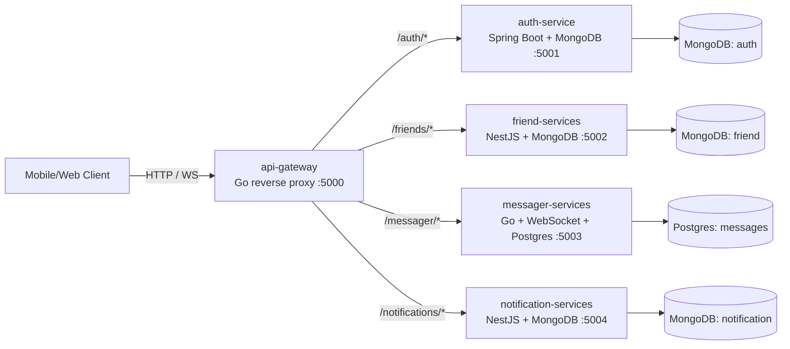

# Backend Architecture (Zalo-like Chat App)

This repository contains a microservices-based backend (Zalo-like chat app). Services are coordinated through an `api-gateway`.

## System overview



Notes:
- Gateway routing is prefix-based (`/auth`, `/friends`, `/messager`, `/notifications`).
- `/messager` supports WebSocket upgrades.

## Auth flow (Register / Login -> JWT -> Authorized calls)

```mermaid
flowchart TD
  Client[Client]
  Gateway[API Gateway\n/auth/*]
  Redis[(Redis OTP)]
  Profiles[(MongoDB users / profiles)]
  Tokens[(MongoDB auth / refresh_tokens)]
  Device[device-service]
  JWT[AuthResponse\naccessToken + refreshToken]
  Protected[Protected APIs\n/users /devices /friends /messenger /notifications]

  SendOtp[POST /auth/send-otp]
  Register[POST /auth/register]
  OtpLogin[POST /auth/verify-otp]
  PasswordLogin[POST /auth/login]
  Refresh[POST /auth/refresh]

  Client -->|phoneNumber| Gateway --> SendOtp
  SendOtp -->|store OTP for 120s\nrate-limit 60s| Redis

  Client -->|phoneNumber + otp + password + displayName\n(+ optional email, deviceInfo)| Gateway
  Gateway --> Register
  Register -->|verify OTP| Redis
  Register -->|create profile| Profiles
  Register -.->|optional device registration| Device
  Register -->|issue refresh token| Tokens
  Register --> JWT

  Client -->|phoneNumber + otp\n(+ optional deviceInfo)| Gateway
  Gateway --> OtpLogin
  OtpLogin -->|verify OTP| Redis
  OtpLogin -->|find or create profile| Profiles
  OtpLogin -.->|optional device registration| Device
  OtpLogin -->|issue refresh token| Tokens
  OtpLogin --> JWT

  Client -->|phoneNumber + password\n(+ optional deviceInfo)| Gateway
  Gateway --> PasswordLogin
  PasswordLogin -->|load profile + verify passwordHash| Profiles
  PasswordLogin -.->|optional device registration| Device
  PasswordLogin -->|issue refresh token| Tokens
  PasswordLogin --> JWT

  Client -->|refreshToken| Gateway --> Refresh
  Refresh -->|validate + rotate| Tokens
  Refresh -->|load user by userId| Profiles
  Refresh --> JWT

  Client -->|Authorization: Bearer accessToken| Gateway --> Protected
```

Notes:
- Public auth routes at the gateway are `send-otp`, `register`, `verify-otp`, `login`, and `refresh`.
- Protected routes must include `Authorization: Bearer <accessToken>`; the gateway validates the JWT before proxying.
- User profiles are stored in `users/profiles`, while refresh tokens are stored separately in `auth/refresh_tokens`.
- `deviceInfo` is optional on register/login/verify-otp. If device registration fails, auth still succeeds.
- In the current dev setup, OTP is mocked to `190603`, stored in Redis for 120 seconds, and can be resent after 60 seconds.

## Service matrix

| Service | Tech | Port | Responsibility |
|---|---|---:|---|
| `api-gateway` | Go (reverse proxy) | 5000 | Single entry point, routes requests by path prefix |
| `auth-service` | Java 17, Spring Boot, MongoDB, Spring Security, JWT | 5001 | User auth, JWT issuance |
| `friend-services` | NestJS, Mongoose (MongoDB) | 5002 | Friend graph / relationships |
| `messager-services` | Go, Gorilla WebSocket, Postgres | 5003 | Real-time chat (WS) + persistence |
| `notification-services` | NestJS, Mongoose (MongoDB) | 5004 | Notifications |

## Key configuration (high level)

- **Mongo services**: ensure the MongoDB URI includes a database name (e.g. `/auth`, `/friend`, `/notification`) or explicitly set the database name via env vars.
- **Postgres**: `messager-services` uses a Postgres DSN (Supabase may require Session Pooler for IPv4-only networks).

